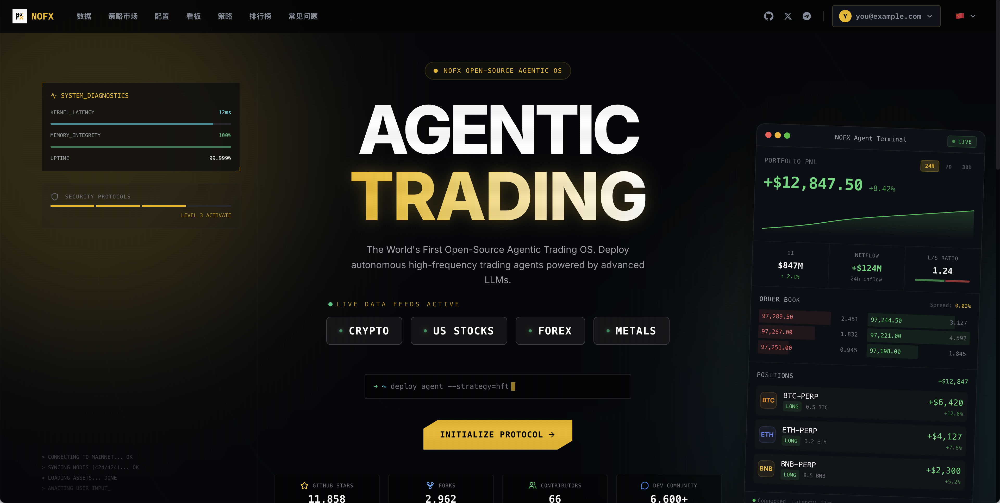

names rewritten to vl on 2026-09-30 (VL rename)
<h1 align="center">VL Intelligent</h1>

<p align="center">
  <strong>당신만의 AI 트레이딩 어시스턴트.</strong><br/>
  <strong>모든 시장. 모든 모델. NinjaTrader 8 CME 선물 (MNQ) 자동 거래.</strong>
</p>

<p align="center">
</p>

<p align="center">
  <a href="https://golang.org/"></a>
  <a href="https://reactjs.org/"></a>
</p>

<p align="center">
  <a href="../../../README.md">English</a> ·
  <a href="../zh-CN/README.md">中文</a> ·
  <a href="../ja/README.md">日本語</a> ·
  <a href="README.md">한국어</a> ·
  <a href="../ru/README.md">Русский</a> ·
  <a href="../uk/README.md">Українська</a> ·
  <a href="../vi/README.md">Tiếng Việt</a>
</p>

---

VL Intelligent는 오픈소스 **자율형** AI 트레이딩 어시스턴트입니다. 수동으로 모델을 설정하고, API 키를 관리하고, 데이터 소스를 연결해야 하는 기존 AI 도구와 달리 — VL Intelligent의 AI는 **시장을 스스로 인식하고, 모델을 스스로 선택하고, 데이터를 스스로 가져옵니다**. 인간 개입 제로. 전략만 설정하면 나머지는 AI가 처리합니다.

**완전 자율**: AI가 어떤 모델을 사용할지, 어떤 시장 데이터를 가져올지, 언제 거래할지를 스스로 결정합니다. 수동 모델 설정 불필요. 여러 서비스의 API 키 관리 불필요. NinjaTrader 8을 연결하고 실행하기만 하면 됩니다.

차별점: **NinjaTrader 8 CME 선물 (MNQ) 단일 경로** — 실시간 시세와 SIM 주문 실행이 동일한 TCP 브리지로 연결됩니다.

**http://127.0.0.1:3000** 을 열면 완료.

---

## 빠른 데모

<p align="center">
  <a href="https://drive.google.com/file/d/1frzw-HDZ3viQvLOQKsAJGc9bT0dXs68D/view">
    
  </a>
</p>

<p align="center">
  커버 이미지를 클릭하면 데모 영상을 볼 수 있습니다.
</p>

---

## 기능

| 기능 | 설명 |
| **멀티 AI** | DeepSeek, Qwen, GPT, Claude, Gemini, Grok, Kimi, MiniMax — 언제든 전환 |
| **NinjaTrader 8** | CME 선물 (MNQ) — 실시간 시세 + SIM 실행 |
| **전략 스튜디오** | 비주얼 빌더 — 심볼 소스, 지표, 리스크 관리 |
| **AI 토론 아레나** | 여러 AI가 거래 토론 (강세 vs 약세 vs 분석가), 투표, 실행 |
| **AI 경쟁** | AI가 실시간 경쟁, 리더보드 순위 |
| **Telegram 에이전트** | 트레이딩 어시스턴트와 채팅 — 스트리밍, 도구 호출, 메모리 |
| **백테스트 랩** | 과거 시뮬레이션, 자산 곡선 및 성과 지표 |
| **대시보드** | 실시간 포지션, 손익, Chain of Thought AI 결정 로그 |

### 시장

CME 선물 (MNQ)

### 거래소 (CME 선물)

| 거래소 | 상태 |
| **NinjaTrader 8** | ✅ — SIM 실행; 시세와 주문이 동일 TCP 브리지 |
### AI 모델 (API 키 모드)

| AI 모델 | 상태 | API 키 받기 |
|  **DeepSeek** | ✅ | [API 키 받기](https://platform.deepseek.com) |
|  **Qwen** | ✅ | [API 키 받기](https://dashscope.console.aliyun.com) |
|  **OpenAI (GPT)** | ✅ | [API 키 받기](https://platform.openai.com) |
|  **Claude** | ✅ | [API 키 받기](https://console.anthropic.com) |
|  **Gemini** | ✅ | [API 키 받기](https://aistudio.google.com) |
|  **Grok** | ✅ | [API 키 받기](https://console.x.ai) |
|  **Kimi** | ✅ | [API 키 받기](https://platform.moonshot.cn) |
|  **MiniMax** | ✅ | [API 키 받기](https://platform.minimaxi.com) |

---

## 설치

### 소스에서

```bash
# 필수 조건: Go 1.21+, Node.js 18+, TA-Lib
# macOS: brew install ta-lib

go build -o vl-bin && ./vl-bin          # 백엔드
cd web && npm install && npm run dev  # 프론트엔드 (새 터미널)
```

---

## 링크

> **위험 경고**: AI 자동 거래에는 상당한 위험이 있습니다. 학습/연구 또는 소액 테스트만 권장합니다.

---

## License

[AGPL-3.0](../../../LICENSE)

