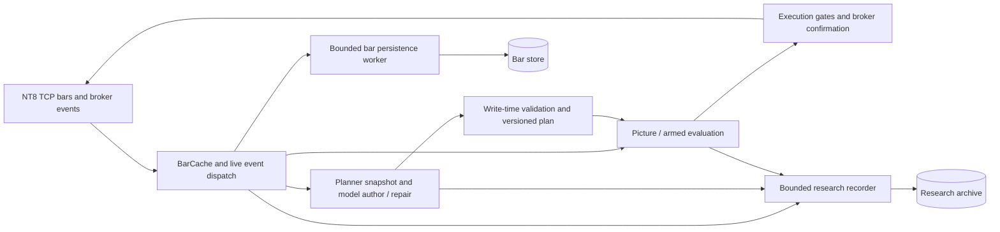

# CTO pipeline efficiency review — 2026-09-27

Status: read-only review; recommendations proposed, no implementation or deployment.

## Decision

Keep the Go process and existing separation between live execution, planning, persistence and research. Improve storage efficiency and measure planner cost before changing decision inputs. Mechanical optimizations should reproduce the same decisions and evidence. Prompt/model changes cannot honestly promise unchanged quality without a controlled comparison.

Priority order: (1) measurement plus lossless archive lifecycle, (2) redundant bar persistence, (3) reuse immutable calculation inputs, (4) planner input experiments after the newly shipped fixes have a live baseline.

## Scope and provenance

Audit conducted 2026-09-27, approximately 00:32–00:38 CT. Session `pipeline-review-20260927/root[unlisted]`, isolated locked worktree `/tmp/nofx-pipeline-efficiency-20260927`, branch `audit/pipeline-efficiency-20260927`; remote claim `28cd8536fdbf53464817f184e5b8b75add8ffdc6`.

[A] Running binary `/proc/21950/exe` reports `vcs.revision=66afdf1ab708c1eec1ef43f472dd0b684575d683`, `vcs.modified=false`. Worktree was cut from accept-time dev `1f0367ecb607417fb2dfb50c5a7d2b9f0d7eeec3`. The complete diff from running source to this base is **only `deploy/RELEASE` (one line changed)**; all inspected production source is identical. This records the source-equivalence qualification to AUDIT-CHECKLIST R9 rather than calling dev the running revision.

Method: source tracing, unauthenticated local health endpoint, systemd metadata, bounded read-only SQLite queries and filtered journal reads. No credentials, configuration changes, database writes, model calls, restarts, main-tree edits or runtime profiling. This is a core Go pipeline review, not an exhaustive C# implementation, frontend, security or profitability audit. No S-grade defect established by this pass. R3 directional execution testing is not applicable to this read-only performance review; long/short replay is required before implementing recommendations.

Reference freshness (`git log -1 -- <path>` at the base):

- `docs/PIPELINE-MAP.md`: `2eaf7ab59 FVG entry model — 5th scenario condition (pure-math play) (#79)`; its as-built header is dated August 25 and predates the current Picture path.
- `docs/superpowers/SYSTEM-MAP.md`: `27437ac12 fix(P1-E): armed lifecycle writes are loud, counted, and fail the slot closed`.
- `docs/superpowers/AUDIT-CHECKLIST.md`: `e0b400683 merge origin/dev d0ece7b50 (#243 FIX-P1A) into fix/double-entry-replay`; followed Part 2 R1–R10 with the source-equivalence qualification above.
- `docs/superpowers/reports/2026-09-26-fix-planner-rejudge.md`: `9fb705173 fix-planner/fold3: corrected killer labels + 80/36 census boundary in the re-judge report`. Used as change context, not fresh proof of outcomes.

[A] marks measured/read evidence; [B] marks an inference or proposed benefit. PROVEN applies to the observation, never an unmeasured speedup.

## Pipeline traced

[A] These separations already exist: `provider/ninjatrader/tcp_server.go:1769`, `provider/ninjatrader/bar_persist.go:81`, `trader/picture_htf_live.go:142`, `trader/auto_trader_clock.go:997`, `trader/auto_trader_planner.go:2098`, `researchsnapshot/recorder.go`. The diagram simplifies multiple callbacks; it does not claim every evaluator shares a single scheduler. Existing no-new-data cadence, repair prompts, bounded workers, provenance, freshness checks and run-generation safeguards should be preserved.

## Findings and recommendations

### 1. Research storage lifecycle — priority 1, grade A observation, PROVEN

[A] `data/data.db.research.db` measured **213,026,574,336 logical bytes (198.396 GiB)** and 213,026,766,848 allocated bytes. SQLite reports page size 4096, page count 52,008,689, freelist 0. Filesystem available space was 306,748,641,280 bytes (285.682 GiB). This is a capacity planning issue, not evidence of imminent exhaustion or a measured growth forecast.

[A] Bounded tail sample IDs **147664553–147665552**, 1,000 records: 912 market, 88 exec; 713,090 JSON characters total. The maximum ID is **not** a table row count. This weekend sample is not representative of an active session.

[A] Journal at **00:37:41 CT**:

> research snapshot rollup: rows=53960 objects={candidate=0 exec=240 market=53720 plan=0 scenario=0} drops=0 queue=0

These are this-process counters. No current recorder backlog was established. `researchsnapshot/volume.go:116` already supports bounded pruning; unset retention means no pruning. `runtime.go:87` runs configured pruning off the boot path. Do not recommend adding a feature that already exists, or silently turning retention on.

[B] Proposed next version: rotate research into immutable time partitions, with a catalog and cross-partition reads; seal, compress and verify older partitions in cold storage. Keep every fact and its original identifiers, timestamps, missing-value semantics and writer revision. Verify exported row counts/checksums and restore/replay before any hot-copy removal. Define an explicit hot-history requirement with the owner. No deletion or bulk VACUUM is authorized by this review. Rotation implementation must handle WAL, in-flight writes and crash recovery explicitly.

Success: lower hot-store size, bounded query latency and verified complete restoration; unchanged evidence coverage, zero introduced drops. Savings are unmeasured. Physical size alone does not prove SQLite is the bottleneck.

### 2. Avoid repeating identical closed-bar writes — priority 2, grade B improvement

[A] `tcp_server.go:1804` derives a tail of up to eight closed bars on live frames. `bar_persist.go:243` obtains a defensive copy of the cache then selects that tail. `bar_persist.go:92` batches worker messages but still invokes the persister separately for each message. `trader/ninjatrader/bar_persist_wire.go:144` calls `InsertBars`. `store/bar_history.go:369` updates conflicting rows unless historical data would overwrite live/mixed; there is no equal-content predicate on that update.

[B] Thus successive frames can submit identical closed rows repeatedly. The frequency and actual disk cost were not measured. First count attempted rows, changed rows, commits, queue delay and write duration. Then consider an equal-content no-op at the store or bounded coalescing in the existing worker. A content-aware cache may skip only previously successful writes; failed writes must remain retryable.

Preserve full key identity, contract, source precedence, convention and corrected OHLCV. A timestamp-only dedup would lose legitimate corrections. Keep the closed-tail recovery mechanism, historical/live ordering and restart behavior. Pin long/short downstream parity, contract roll, replay-after-live, same-minute correction, disconnect and failed-write retries. Require identical final bar stores and derived decision outputs before shipping.

SQLite transactions can amortize per-operation overhead, but batch size must stay bounded and durability must remain unchanged. See [SQLite FAQ, transaction performance](https://www.sqlite.org/faq.html) and [WAL concurrency](https://www.sqlite.org/wal.html). More writer goroutines are not a demonstrated solution to a single-writer database.

### 3. Reuse immutable inputs before caching decisions — priority 3, grade B improvement

[A] `BarCache.Get` copies the entire stored slice (`provider/ninjatrader/bar_cache.go:450`). Planner assembly separately requests daily, hourly and two 5m horizons (`auto_trader_planner.go:3064`), then requests configured structure timeframes (`:3130`), indicator state and zones. These requests have different semantics; their existence alone does not prove waste.

[B] Profile first, then introduce a scoped read snapshot or bounded cache for demonstrably repeated pure computations. Key it by contract, timeframe, data revision including corrections, requested horizon, closed/forming policy, configuration and relevant evaluation clock/session. Reuse a larger snapshot's exact subset only where existing semantics permit. Preserve defensive ownership so callers cannot mutate shared state.

Never cache broker truth, risk permission, order placement, born-dead judgment or a live freshness decision as a reusable boolean. An immutable snapshot must not accidentally replace a reader that is supposed to re-sight current tape at publish/send time. Accept only after exact input/output replay parity, including late bars, corrections and rollovers. Benefit remains UNVERIFIED until profiles and benchmarks show it.

### 4. Planner efficiency — priority 4 experiment, not permission to reduce quality

[A] Latest 30 `decision_records`, IDs **46669–46698**, September 25 **15:01:23–15:59:19 CT**, had median stored AI latency **6,664.5 ms**, nearest-rank p95 **15,639 ms**, and combined system/input prompt length **29,033–29,666 characters**. These are executor decision records, **not planner timings**.

[A] Latest 30 rejected planner rows, IDs **389–418**, include 14 attempt-1 prompts of **155,550–223,526 characters**; 11 of the 30 reasons mention born-dead. This is a rejection-selected sample: it cannot establish an overall rejection rate or the rate of killed reads. Characters are not tokens.

[A] `planner_read_facts` IDs **279–308** all store `tokens_in=0`; do not interpret that as zero usage or use it to estimate spend. Check provider usage capture and its unknown/not-recorded representation before making cost claims.

Crucially, these trading samples predate the currently running September 26 boot. The current source already uses targeted repair (`auto_trader_planner.go:2118`) and fresh tape (`:2138`), and contains the new planner fixes. Their live-session improvement is **EVENT-WAIT**: await representative accepted and rejected reads on `66afdf1ab708`, with revision, model/config, attempt, latency, usage and outcome attached. This review does not call an old failure a current regression.

[B] After that baseline, first optimize byte-identical prompt construction and deterministic precomputed facts. Any shortening of the actual model input, changed call cadence or cheaper model is a separate decision-quality experiment. Keep full source snapshots archived. Compare accepted scenario coverage, first-pass validity, retries, stale-at-publication outcomes, omitted relevant levels, arm eligibility and risk refusals across paired inputs and multiple sessions. Faster replies or fewer rejections alone are not evidence of equal quality. Do not weaken validators to obtain a better performance number.

## Measurement and release contract

Extend existing metrics (`telemetry/metrics.go` already has decision latency; recorder already reports rows/drops/queue) rather than build a second observability stack. Correlate one snapshot/read ID across feed receipt, feature assembly, model attempts, validation and publication; use event/order identity for execution. Track p50/p95/p99, queue age/depth, correction-aware cache hit rate, allocations, committed writes, archive growth and actual provider usage. Avoid unique IDs as metric labels; keep those in structured logs/traces.

Run a captured replay first. Collect bounded CPU, heap and blocking profiles separately when needed, measuring diagnostic overhead; [Go diagnostics](https://go.dev/doc/diagnostics) explains their distinct uses. Current weekend/no-feed CPU and health cannot benchmark a busy session. No production profiler was enabled by this review.

For mechanical work: same inputs, same clocks, same contract/config, same deterministic outputs and order intents; no new dropped closes or evidence, no weaker freshness/risk gates. Benchmark before/after on identical tapes including busy open, quiet tape, reconnect and contract roll. Run the merged suite and existing deployment protocol only in a separately authorized implementation wave.

For model-input changes: exact decision identity is not guaranteed. Require explicit, predeclared quality criteria and repeated shadow comparisons; retain rollback. No numerical speedup or quality guarantee is claimed here.

## Alternatives and immediate action

Retain the current monolith with its existing workers. A service split or database replacement adds deployment and consistency work without a measured bottleneck justifying it in this audit. Disabling research, shrinking history, lowering model capability, or dropping safety checks would change the quality contract.

Start with a measurement/storage wave, then one narrowly scoped persistence optimization if measurements justify it. Update `docs/PIPELINE-MAP.md` in that implementation wave so the overview includes the shipped Picture and planner paths. This review created only this report; no tests were run because no executable code changed.
